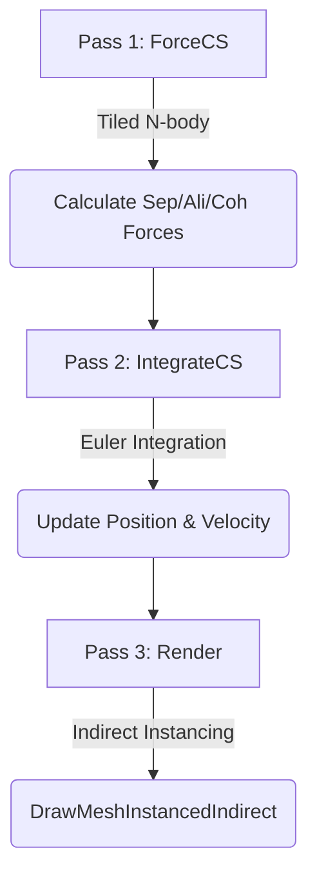

# Unity GPU Boids Simulation

### Project Overview

**Boids Simulation** is a large-scale flocking simulation implementing Craig Reynolds' Boids algorithm (1987) using **GPU Compute Shaders**. Over **16,000 agents** exhibit natural flocking behavior in real-time, achieving **60fps performance** through massive parallel processing on the GPU.

---

## 🎥 Key Technologies

### 1. Craig Reynolds' Boids Algorithm
Emergent flocking behavior arises from three simple rules:
- **Separation**: Steer to avoid crowding local flockmates.
- **Alignment**: Steer toward the average heading of local flockmates.
- **Cohesion**: Steer toward the average position of local flockmates.

### 2. GPU Compute Shader Optimization
Implemented parallelized O(n²) neighbor search on the GPU:
- **Tiled N-body Algorithm**: Optimized memory access using Shared Memory tiling.
- **Double Buffering**: Separate read/write buffers to prevent race conditions.
- **Thread Group Optimization**: 256-thread groups for maximum GPU occupancy.

### 3. GPU Instanced Rendering
Renders tens of thousands of meshes in a single draw call:
- **Indirect Draw Call**: GPU-based instancing with zero CPU overhead.
- **Direct ComputeBuffer Access**: Vertex shader reads simulation data directly from GPU memory.
- **Automatic Frustum Culling**: Optimized bounds calculation based on the simulation area.

### 4. Interactive Control
Real-time mouse-based interaction:
- **Attract/Repel**: Left-click to attract, Right-click to repel/rotate.
- **Real-time Tuning**: Adjust behavior weights, speeds, and radii on the fly.

---

## ⚙️ Rendering Pipeline



*(Note: The actual implementation uses a Compute Shader dispatch for passes 1 & 2, followed by a graphics draw call.)*

```
┌─────────────────────────────────────────────────────────────┐
│                  GPU BOIDS PIPELINE                         │
├─────────────────────────────────────────────────────────────┤
│  Pass 1: ForceCS      │ Tiled N-body → Sep/Ali/Coh forces   │
│  Pass 2: IntegrateCS  │ Euler integration → Update pos/vel  │
│  Pass 3: Render       │ Indirect Instancing → Mesh render   │
└─────────────────────────────────────────────────────────────┘
```

---

## 🧮 Mathematical Foundations

### Reynolds Steering Formula
```c
Steering = Desired_Velocity - Current_Velocity
Steering = limit(Steering, MaxSteerForce)
```
The steering force is calculated as the difference between the desired velocity and the current velocity, clamped to a maximum force.

### Separation Force
```c
Repulsion_i = normalize(MyPos - NeighborPos_i) / distance_i
Separation = Σ Repulsion_i / count
```
Calculates the sum of inverse-distance weighted repulsion vectors to smoothly avoid collisions.

### Tiled N-body Optimization
```
Global Memory Access: O(n²)
Tiled Access:         O(n² / TILE_SIZE)
Speedup:              ~TILE_SIZE times (e.g., 256x theoretical peak)
```

---

## 🚀 Technical Challenges & Solutions

### Challenge 1: O(n²) Neighbor Search Performance Bottleneck
**Problem**: 16,000 boids × 16,000 neighbors = 256 million distance calculations per frame. Impossible on CPU.
**Solution**:
1.  **GPU Parallelization**: One GPU thread per boid (16,000 threads).
2.  **Tiled N-body**: Cache 256 boids at a time in fast **Shared Memory**.
3.  **Coalesced Access**: Ensure consecutive threads access consecutive memory addresses.
```hlsl
// Tile load → sync → process → sync → next tile
boid_data[GI] = _BoidDataBufferRead[N_block_ID + GI];
GroupMemoryBarrierWithGroupSync();
// ... process 256 boids in tile ...
GroupMemoryBarrierWithGroupSync();
```

### Challenge 2: Read/Write Buffer Conflict (Data Race)
**Problem**: Reading and writing to the same buffer simultaneously caused data corruption (mixing pre/post-update states).
**Solution**:
-   **Two-pass Separation**: `ForceCS` (read-only) → `IntegrateCS` (write-only).
-   **Double Buffering**: Use distinct `_BoidDataBufferRead` and `_BoidDataBufferWrite` buffers.
-   **Ping-Pong**: Swap read/write buffer roles at the end of each frame.

### Challenge 3: GPU Instanced Rendering Bounds
**Problem**: `DrawMeshInstancedIndirect` requires bounds for frustum culling. Calculating individual bounds for 16,000 dynamic objects on the CPU is too slow.
**Solution**:
-   **Static Bounds**: Use the entire simulation area (Wall dimensions) as the bounding box.
-   **Logic Guarantee**: The "Avoid Wall" force guarantees boids stay within these bounds.
```csharp
var renderBounds = new Bounds(
    GPUBoidsScript.GetSimulationAreaCenter(),
    GPUBoidsScript.GetSimulationAreaSize()
);
```

### Challenge 4: Thread Group Size Mismatch
**Problem**: If the boid count (e.g., 16,384) isn't perfectly divisible by the thread group size (256), out-of-bounds memory access occurs.
**Solution**:
-   **Ceiling Division**: Calculate thread groups: `Mathf.CeilToInt(Count / 256.0f)`.
-   **Alignment**: Constrain boid count to multiples of 256 to eliminate shader branching overhead.

### Challenge 5: CPU-GPU Data Transfer Overhead
**Problem**: Transferring boid position data from GPU to CPU every frame for rendering creates a massive bandwidth bottleneck.
**Solution**:
-   **GPU-Resident Pipeline**: Keep all simulation data in GPU memory.
-   **Direct Shader Access**: Bind `ComputeBuffer` directly to the material/vertex shader.
-   **Zero Transfer**: No `GetData()` calls during the simulation loop.

### Challenge 6: Behavior Weight Balancing
**Problem**: Incorrect weights led to chaotic scattering or overly dense clustering.
**Solution**:
-   **Prioritized Separation**: Separation weight is highest to prevent collapse.
-   **Independent Radii**: Distinct detection radii for each behavior.
-   **Tuning UI**: Real-time parameter adjustment to find the "sweet spot".
```
Default Balance: Separation(3.0) > Cohesion(1.0) = Alignment(1.0)
Neighbor Radii:  Separation(1.0) < Alignment(2.0) = Cohesion(2.0)
```

---

## 🎮 Controls & Parameters

### Controls
*   **Left Mouse Click**: **Attract** - Boids flock towards the cursor (Green indicator).
*   **Right Mouse Click**: **Repulse + Rotate** - Boids flee from the cursor (Red indicator) while rotating the orbital camera.
*   **Mouse Wheel**: **Zoom** - Zoom the camera in and out.
*   **ESC**: **Exit** - Close the simulation.

### Simulation Parameters

| Category | Parameter | Description |
|----------|-----------|-------------|
| **Population** | Max Boid Count | Total number of boids (256 ~ 32,768) |
| **Behavior** | Separation Weight | Strength of collision avoidance |
| **Behavior** | Alignment Weight | Strength of velocity matching |
| **Behavior** | Cohesion Weight | Strength of grouping tendency |
| **Behavior** | Avoid Wall Weight | Strength of boundary containment |
| **Movement** | Max Speed | Limit on velocity magnitude |
| **Movement** | Max Steer Force | Limit on turning responsiveness |
| **Detection** | Separation Radius | Range for collision avoidance |
| **Detection** | Alignment Radius | Range for velocity matching |
| **Detection** | Cohesion Radius | Range for grouping detection |

---

## 🛠 Tech Stack

*   **Engine**: Unity (URP)
*   **Languages**: C#, HLSL (Compute Shader)
*   **Techniques**: GPU Compute, Instanced Rendering, Tiled N-body Simulation

---

## 📝 License & References

*   Based on [Craig Reynolds' Boids Algorithm](http://www.red3d.com/cwr/boids/).
*   Developed for educational and portfolio purposes.
