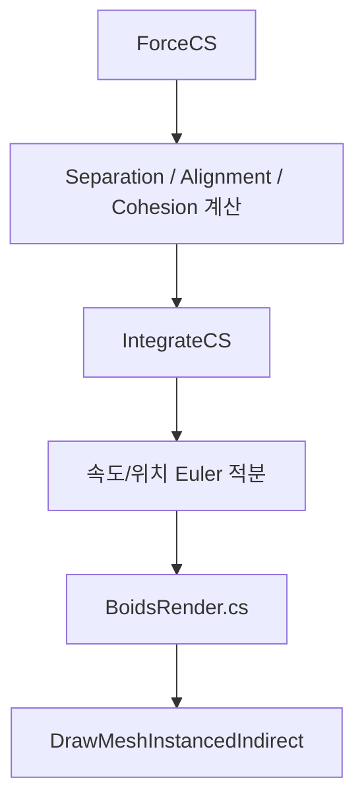

# Unity GPU Boids Simulation

[English Version](#english)

## 프로젝트 개요
이 프로젝트는 Unity Compute Shader를 사용해 Boids 군집 알고리즘을 GPU에서 대규모 병렬 처리하는 데모입니다.  
현재 코드 기준으로 `ForceCS`와 `IntegrateCS` 2단계 커널을 매 프레임 실행하고, `DrawMeshInstancedIndirect`로 보이드를 한 번에 렌더링합니다.

- 기본 보이드 수: `16,384`
- 최대 보이드 수(UI): `65,536` (256 단위로 반올림)
- 렌더링: GPU 인스턴싱 기반 간접 드로우
- 인터랙션: 마우스 기반 흡인/반발 + 실시간 UI 튜닝

## 데모 영상
[](https://youtu.be/zoZexSNFHc8)

## 현재 코드 구조
```text
Assets/
  Scenes/
    Main.unity
  Scripts/
    GPUBoid/
      GPUBoids.cs         # 시뮬레이션 파라미터, 버퍼 관리, 커널 Dispatch
      Boids.compute       # ForceCS / IntegrateCS
      BoidRender.cs       # DrawMeshInstancedIndirect 렌더링
    Demo/
      BoidSimulationUI.cs # 슬라이더/버튼 UI
      MouseAttractor.cs   # 마우스 흡인/반발
      CameraController.cs # 궤도 카메라
      FPSCounter.cs       # FPS 표시
      EscToExit.cs        # ESC 종료
  Shaders/
    BoidsRender.shader    # StructuredBuffer 기반 인스턴스 변환/조명
```

## 시뮬레이션 파이프라인


## 실행 환경
- Unity Editor: `6000.2.6f2`
- Render Pipeline: `URP (com.unity.render-pipelines.universal 17.2.0)`
- 주요 언어: `C#`, `HLSL`

## 실행 방법
1. Unity Hub에서 프로젝트를 엽니다.
2. `Assets/Scenes/Main.unity`를 엽니다.
3. Play를 눌러 실행합니다.

## 조작법
- `좌클릭`: 마우스 위치로 보이드 흡인 (초록 인디케이터)
- `우클릭`: 보이드 반발 + 카메라 회전 (빨강 인디케이터)
- `마우스 휠`: 줌 인/아웃
- `ESC`: 종료

## UI 파라미터(현재 구현 기준)
- Boid Count: `1000 ~ 65536` 슬라이더 값, 실제 반영은 `256` 배수로 반올림 후 Reset 시 재초기화
- Speed: `1 ~ 20` (`MaxSpeed`)
- Separation/Alignment/Cohesion: 각 `0 ~ 10` 가중치
- Pause/Resume: `Time.timeScale` 제어
- Reset: 현재 Boid Count 기준으로 GPU 버퍼 재생성

## 구현 포인트
- `GPUBoids.cs`
  - `ComputeBuffer` 2종 사용: 보이드 상태(`BoidData`), 힘 버퍼(`Vector3`)
  - 매 프레임 커널 2회 Dispatch
  - 벽 회피(`_AvoidWallWeight`) 및 마우스 attractor 파라미터 전달
- `Boids.compute`
  - `numthreads(256,1,1)` + `groupshared` 타일 캐시
  - Separation/Alignment/Cohesion 계산 후 Euler 적분
- `BoidRender.cs` + `BoidsRender.shader`
  - 보이드 상태 버퍼를 머티리얼에 직접 바인딩
  - 인스턴스별 위치/방향(속도 벡터 기반 회전) 변환을 GPU에서 처리

## 주의사항
- Compute Shader 블록 크기(`256`) 기준으로 동작하므로 보이드 수는 `256` 배수 사용을 권장합니다.
- 보이드 수가 증가할수록 이웃 탐색 비용은 본질적으로 `O(n^2)`이므로 GPU 성능 영향을 크게 받습니다.
- 본 프로젝트는 교육/포트폴리오 목적의 데모 구현입니다.

## 참고
- Craig Reynolds Boids: http://www.red3d.com/cwr/boids/

---

## English
Unity GPU Boids Simulation project using Compute Shaders and indirect instanced rendering.

- Scene: `Assets/Scenes/Main.unity`
- Core scripts: `GPUBoids.cs`, `Boids.compute`, `BoidRender.cs`
- Unity version: `6000.2.6f2`
- URP: `17.2.0`

Controls:
- Left click: attract boids
- Right click: repel boids + rotate camera
- Mouse wheel: zoom
- ESC: quit

The simulation runs in two compute passes (`ForceCS`, `IntegrateCS`) and renders via `DrawMeshInstancedIndirect` using GPU-resident boid data.
