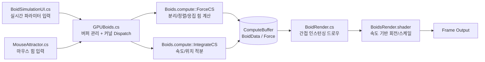
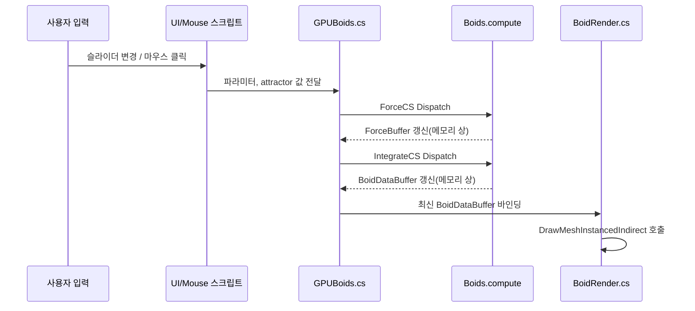
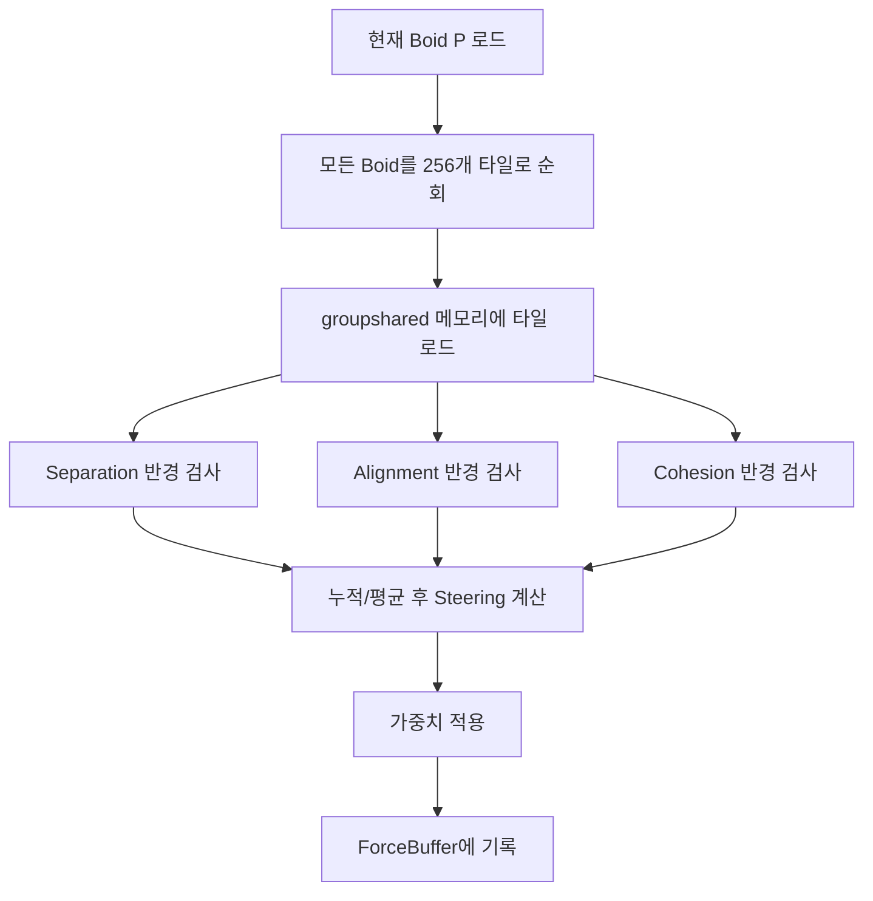

# GPU Boids Simulation

[한국어](#korean) | [English](#english)

## 한국어

### 프로젝트 소개
Unity Compute Shader와 GPU Instancing을 활용해 대규모 Boids 군집 시뮬레이션을 실시간으로 구동하는 프로젝트입니다.
CPU 중심 구현에서 발생하는 병목(개체 수 증가 시 프레임 하락)을 GPU 병렬 처리로 완화하는 데 초점을 맞췄습니다.

### 목차
- [데모](#데모)
- [한눈에 보기](#한눈에-보기)
- [문제 정의와 목표](#문제-정의와-목표)
- [시스템 아키텍처](#시스템-아키텍처)
- [프레임 처리 흐름](#프레임-처리-흐름)
- [알고리즘/구현 상세](#알고리즘구현-상세)
- [실행 방법](#실행-방법)
- [조작 방법](#조작-방법)
- [런타임 튜닝](#런타임-튜닝)
- [성능/확장성](#성능확장성)
- [트러블슈팅](#트러블슈팅)

### 데모

- 영상: https://www.youtube.com/watch?v=zoZexSNFHc8
- 실행 씬: `Assets/Scenes/Main.unity`

### 한눈에 보기
| 구분 | 내용 |
|---|---|
| Engine | Unity `6000.2.6f2` |
| Rendering | URP `17.2.0` |
| Simulation | Compute Shader (HLSL) |
| Runtime | C# MonoBehaviour |
| GPU Draw | `Graphics.DrawMeshInstancedIndirect` |
| UI | uGUI + TextMeshPro |

### 문제 정의와 목표
- 목표: 수천~수만 개 에이전트를 실시간으로 업데이트하고 인터랙티브하게 제어
- 제약: 시뮬레이션 계산 + 렌더링 + 입력 반영을 프레임 단위로 동시에 처리
- 해결 방향
  - Boids 핵심 계산을 Compute Shader로 이동
  - 보이드 상태를 GPU 메모리에 유지해 CPU-GPU 왕복 최소화
  - `DrawMeshInstancedIndirect`로 대량 인스턴스 렌더링 오버헤드 완화

### 시스템 아키텍처

### 프레임 처리 흐름

### `ForceCS` 내부 연산 구조 (요약)

### 알고리즘/구현 상세
#### 1) Boids 규칙
- Separation: 근접 개체와 충돌하지 않도록 분리
- Alignment: 주변 속도 평균 방향으로 정렬
- Cohesion: 주변 개체의 중심점으로 응집

#### 2) 환경 힘
- 벽 이탈 시 반대 방향 가속(`avoidWall`)
- 마우스 입력 기반 attract/repel 힘 주입

#### 3) 수치 적분
- Euler 적분으로 속도/위치 갱신
- `MaxSpeed`, `MaxSteerForce`로 안정성 제어

#### 4) 렌더링 전략
- 인스턴스 변환을 CPU가 아닌 셰이더(Vertex)에서 계산
- 속도 벡터 기반으로 메시 방향 회전

### 실행 방법
1. Unity Hub에서 프로젝트를 열고 에디터 버전을 `6000.2.6f2`로 맞춥니다.
2. `Assets/Scenes/Main.unity`를 엽니다.
3. Play 버튼으로 실행합니다.

### 조작 방법
- 우클릭 드래그: 카메라 회전
- 마우스 휠: 줌
- 좌클릭: Boid 끌어당김
- 우클릭: Boid 밀어냄
- `Esc`: 빌드 실행 시 종료

### 런타임 튜닝
- Boid Count: UI 슬라이더 값은 `Reset` 클릭 시 실제 버퍼 재생성에 반영
- Speed: 최대 이동 속도
- Separation / Alignment / Cohesion: 각 행동 가중치
- Pause / Resume: `Time.timeScale` 제어

### 성능/확장성
#### 장점
- CPU per-instance 업데이트를 제거해 개체 수 증가에 유리
- 시뮬레이션과 렌더링을 GPU 중심으로 일관되게 구성
- 입력 상호작용이 있어도 파이프라인 단순성 유지

#### 현재 한계
- 이웃 탐색은 본질적으로 `O(n^2)` 성격
- 보이드 수 증가에 따라 GPU 연산량이 급격히 증가
- 우클릭 입력이 카메라 회전과 겹칠 수 있음

#### 개선 아이디어
- Uniform Grid / Spatial Hash로 이웃 후보군 축소
- Compute 단계 분리(해시 생성/정렬/근접 탐색)
- LOD 기반 원거리 단순화 렌더링
- 인게임 벤치마크(Boid 수/FPS 자동 스윕) 추가

### 트러블슈팅
- 이슈: 개체 수 증가 시 CPU 루프 기반 구현에서 프레임 하락
- 대응: Boid 상태를 `ComputeBuffer`로 전환하고 GPU에서 힘 계산/적분 수행
- 이슈: 인스턴스 수 증가에 따른 CPU Draw Call 오버헤드
- 대응: `DrawMeshInstancedIndirect` 도입으로 드로우 호출 수 고정
- 이슈: 파라미터 변경 즉시 반영 시 버퍼 재할당 타이밍 문제
- 대응: Boid 수 변경은 `Reset` 시점에 반영하도록 분리

---

## English

Large-scale boid flocking simulation built with Unity Compute Shaders and GPU indirect instancing.

### Demo
- Video: https://www.youtube.com/watch?v=zoZexSNFHc8
- Scene: `Assets/Scenes/Main.unity`

### Highlights
- Two-pass GPU simulation: `ForceCS` + `IntegrateCS`
- GPU-driven rendering via `DrawMeshInstancedIndirect`
- Real-time controls: boid count, speed, behavior weights, pause/reset
- Interactive mouse attract/repel behavior

### Run
1. Open the project with Unity `6000.2.6f2`.
2. Open `Assets/Scenes/Main.unity`.
3. Press Play.
